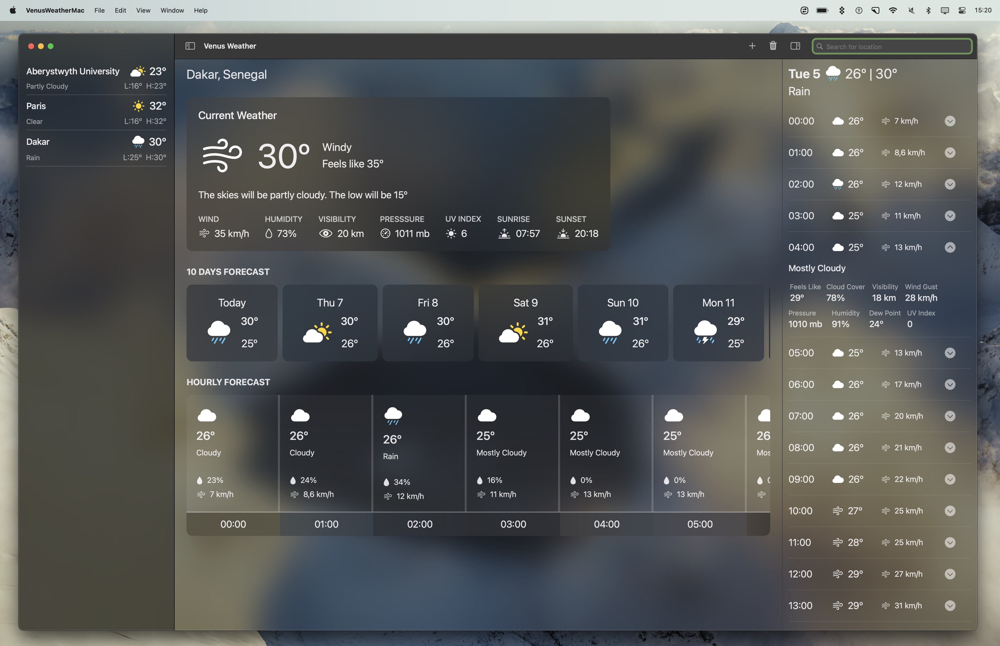
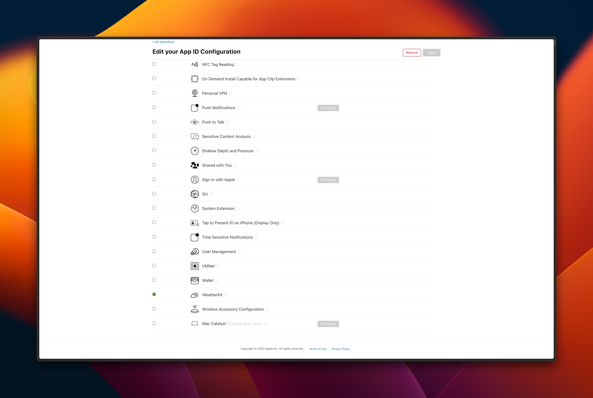
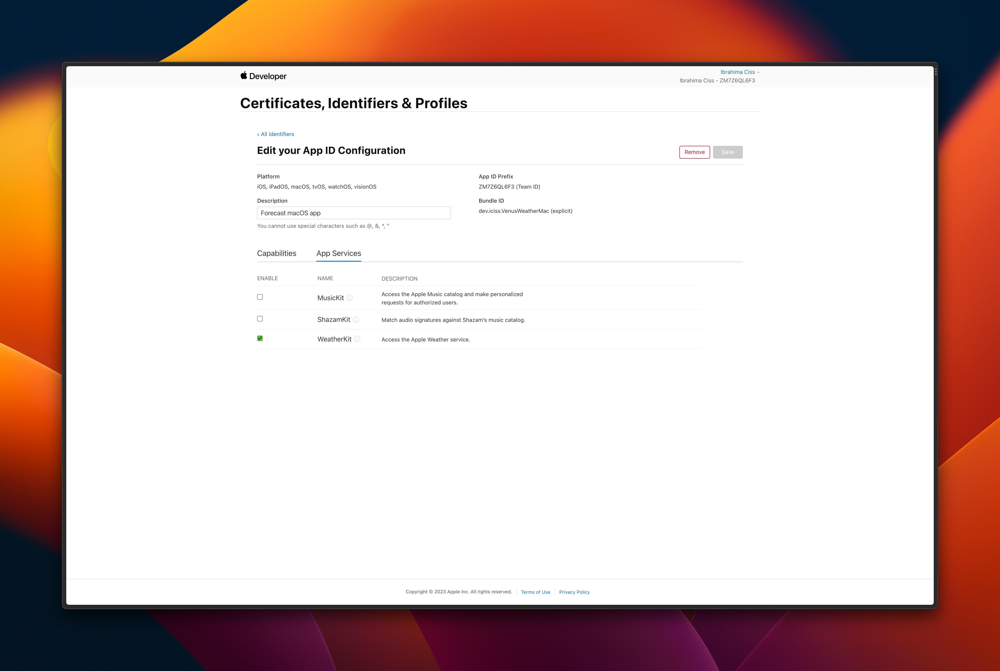

# Making polished macOS apps with SwiftUI

A workshop to help you realise how easy it is to build beautiful and fully functional macOS apps with SwiftUI.

I hope you'll be excited about building a macOS app in a near future! Feel free to reach out to me on [Twitter](https://x.com/bionik6).

### Important note
Since the app is using WeatherKit, you need to register it in the app developer console.
Go to the [Identifier section](https://developer.apple.com/account/resources/identifiers/list), register the app and change its capabilities. You need to activate it in two places actually.
| Capabilities tab | App services tab |
|-|-|
|  |  |

### Resources
- [Designing for macOS](https://developer.apple.com/design/human-interface-guidelines/designing-for-macos)
- [Atomic Design Methodology](https://atomicdesign.bradfrost.com/chapter-2/)
